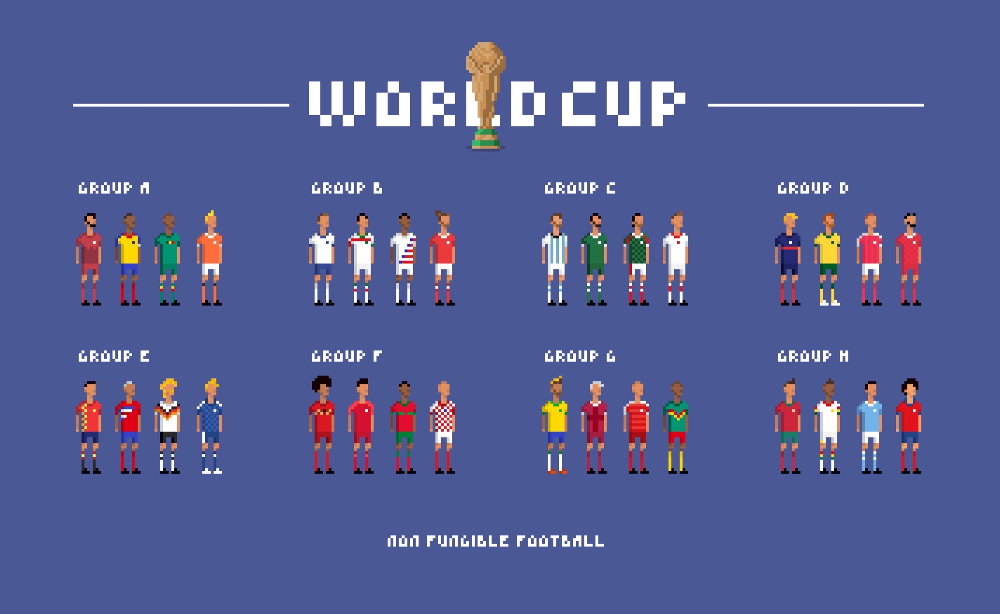

# Non Fungible Football

Non Fungible Football is an onchain game that will take place during the World Cup 2022 (22 Nov to 20 Dec).

It's an NFT based game, where players randomly draw a player at the beginning of the tournament and progress through the tournament with the player they currently own.

## Rules

1. 1 Player == 1 NFT.
1. 32 national teams with 26 players each == 832 total players.
1. Once a team is knocked out, all its players are knocked out.
1. Holders of the championship teams players win a portion of the pot.

## Implementation

Everything is stored onchain. Player NFT's, the tournament results, the tournament logic. We take advantage of Starknet computational abilities to resolve the tournament. Fixture results are commited by an oracle (soon to be a vote by players).

## Minting

Players will be auctioned off using a [Gradual Dutch Auction](https://www.paradigm.xyz/2022/04/gda). A percentage of proceeds from the player auction will accumulate into a pool (final prize).

Players will be revealed after the mint is complete, so you can't pick a player or team.

The winners will receive a trophy, which unlocks the final prize.
